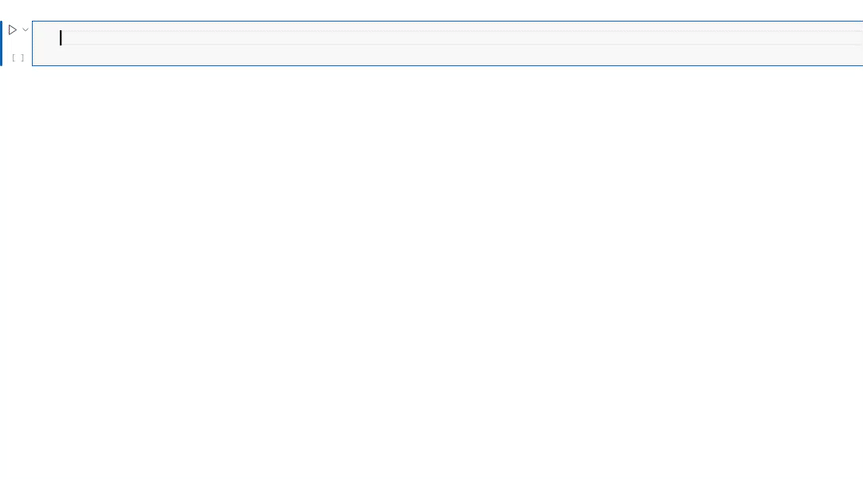

# ML Shortcut Libary
A Visual Studio Code shortcut libary designed to simplify and accelerate machine learning development in python.

#### Why Use ML Shortcuts?
ML Shortcuts helps streamline your machine learning workflow by providing quick access to commonly used code snippets and tools, making your development process more efficient and productive. 

#### Features
  * Snippets for common ML libraries (Pandas, Numpy, TensorFlow, scikit-learn etc.)
  * Quick data visualization tools
  * Code completion for ML tasks
  * Customizable shortcuts for frequent operations
  * Inline model performance metrics

## Installation

Copy and paste the content of python.json to the user snippet JSON file of Visual Code Studio. 

To use the snippets of the libary just start typing the prefixes of the snippets and accept them via autocomplete. 

All prefixes and codes can be customized in the user snippet JSON file. 